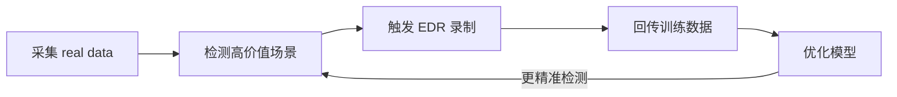
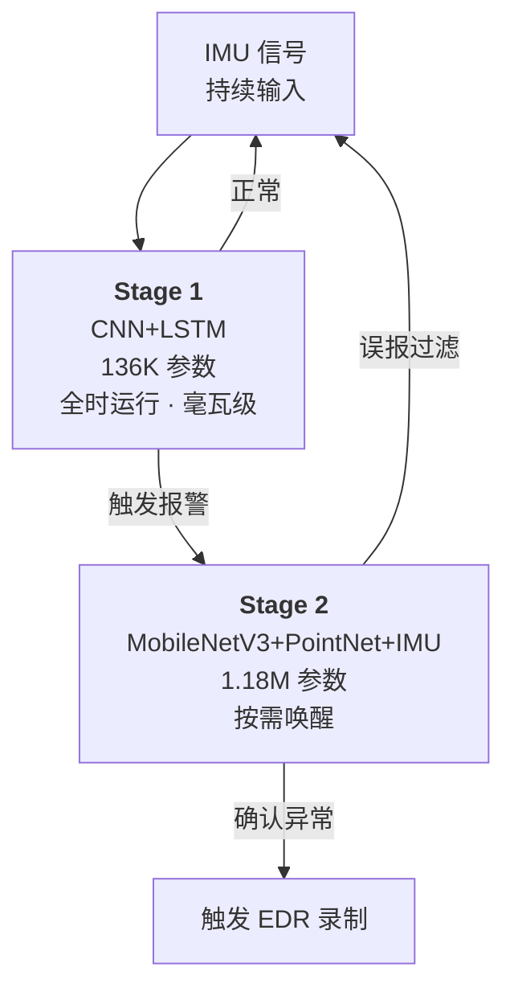

# 数据挖掘

> 聚焦：自动驾驶长尾数据挖掘 — 从 real data 中挖掘高价值场景，触发 EDR 录制，完成数据闭环

- [EDR 系统](#edr-系统)
- [仿真数据源](#仿真数据源)
- [车端通信](#车端通信)

<details open>
<summary>

## EDR 系统

</summary>

<h3 style="color: #059669;">YfMiner：自动驾驶 EDR 触发与数据闭环</h3>

<blockquote style="border-left: 4px solid #059669; padding: 12px 16px; background: #ecfdf5; margin: 12px 0; border-radius: 0 4px 4px 0;">
💡 <strong>一句话总结</strong>：数据闭环的本质是"采集 → 挖掘 → 训练 → 更好挖掘"的正反馈循环，级联架构以毫瓦级常驻 + 按需唤醒实现低功耗与高精度的平衡。
</blockquote>

用户项目：[YfMiner](https://github.com/666777zhou/YfMiner)

#### 核心思路

- 目标：解决**长尾问题**——高风险场景是小概率事件，需要从海量数据中精准挖掘



#### 级联架构（Cascade）



- **Stage 1 — IMU 异常检测器（136K 参数）**：`CNN + LSTM`，只吃 IMU 信号（2 秒窗口），功耗**毫瓦级**，全时运行，召回率 ≥ 95%
- **Stage 2 — 多模态融合确认（1.18M 参数）**：`MobileNetV3 + PointNet + IMU`，融合前视图像 + LiDAR + IMU，精度 ≥ 90%，仅在 Stage 1 报警时唤醒
- 设计哲学：轻量级常驻检测 + 高精度按需确认 = 低功耗 + 高准确

#### 伪标注（Pseudo-Labeling）

- `KITTI` 无真实碰撞标签，用物理阈值规则打伪标签
- 急刹车：前向加速度 < -1.5 m/s² 持续 2 帧
- 急加速：前向加速度 > 2.0 m/s² 持续 2 帧
- 急转弯：横向加速度 > 2.0 m/s² 或横摆角速度 > 0.3 rad/s

#### 部署工具链

```
PyTorch 训练
  └─ 导出 ONNX
       └─ 高通 QNN SDK 编译
            ├─ 图优化
            └─ INT8 量化
                 ├─ 32-bit 浮点 → 8-bit 整数
                 └─ 生成 .dlc 文件
                      └─ 部署 SA8650 NPU
                           ├─ 推理速度 ↑ 2-4x
                           └─ 功耗 ↓ 大幅降低
```

- 端侧约束：模型 < 2MB，功耗毫瓦级常驻，实时性要求高

#### QNN（Qualcomm Neural Network）

<blockquote style="border-left: 4px solid #059669; padding: 12px 16px; background: #ecfdf5; margin: 12px 0; border-radius: 0 4px 4px 0;">
💡 <strong>一句话总结</strong>：QNN 是高通的神经翻译器——把 PyTorch/TensorFlow 模型翻译成 SA8650 NPU 能听懂的私有指令，沿途做 INT8 压缩和计算图优化。没有它，NPU 就是块废铁。
</blockquote>

- **不是训练框架**，是**部署工具链**——负责把服务器上训好的模型搬到高通芯片上跑
- **核心部件**：`qnn-converter`（ONNX → `.dlc`）、`qnn-quantizer`（FP32 → INT8）、`libQnnHtp.so`（NPU 运行时库）
- **为什么需要它**：SA8650 的 NPU（HTP）指令集是私有的，普通编译器不认识，必须用高通自己的工具链
- **NPU vs GPU**：NPU 用脉动阵列一个时钟周期完成一块矩阵运算，专门为神经网络优化，不是 GPU 浮点单元一个个算
- 结合交叉编译：QNN 的 `--target aarch64` 在 x86 PC 上生成 ARM NPU 能跑的二进制

#### 数据源

- `KITTI RAW`：OXTS GPS/IMU（30 维遥测，10Hz）、四路摄像头、Velodyne 64 线 LiDAR
- 未来方向：接入更多驾驶数据源，持续扩充高价值场景库

</details>

<details open>
<summary>

## 仿真数据源

</summary>

<h3 style="color: #0891b2;">Omni-Dreams 与 Cosmos</h3>

<blockquote style="border-left: 4px solid #0891b2; padding: 12px 16px; background: #ecfeff; margin: 12px 0; border-radius: 0 4px 4px 0;">
💡 <strong>一句话总结</strong>：长尾场景在真实驾驶中天然稀少，世界模型可以从零生成这些极端场景——万分之一概率的急刹、鬼探头，仿真可以无限制造。
</blockquote>

#### NVIDIA Cosmos

世界基础模型家族，为物理 AI 生成逼真合成数据：

- **Cosmos Transfer**：结构化输入（语义分割、深度图、LiDAR、3D 框）→ 逼真视频，可控天气/光照
- **Cosmos Predict 2.5**：预测未来世界状态（最长 30 秒），微调后精度提升 10 倍
- **Cosmos Reason 2**：时空推理 + Chain-of-Thought，256K token 上下文窗口
- **Cosmos 3**：统一视觉、推理、动作的"全模态模型"
- **NuRec / InstantNuRec**：真实车队数据 → 3D 高斯可编辑场景，无需逐场景优化
- **Cosmos-Drive-Dreams**：81,802 条合成驾驶视频 + HD Map + LiDAR，覆盖雨/雪/雾/夜间

#### OmniDreams

实时生成式世界模型，专为自动驾驶闭环仿真设计：

- **核心能力**：根据驾驶动作实时生成下一帧多摄像头画面——方向盘打多少、画面变多少
- **关键参数**：2B 参数，基于 `Diffusion Transformer`，21000 小时驾驶数据，~52 FPS @ 720p
- **三级训练**：教师模型 → Diffusion Forcing 学生模型 → Self-Forcing + DMD 蒸馏

#### 底层技术概念

- **世界模型**：学习世界如何运转——给当前状态 + 动作，预测下一刻世界状态。传统视频生成只管"好不好看"，世界模型要求"对不对"
- **Diffusion Transformer**：扩散去噪 + Transformer 自注意力，替代传统 U-Net
- **Diffusion Forcing**：扩散模型按时间顺序自回归生成，每帧以过去帧和当前动作为条件

</details>

<details open>
<summary>

## 车端通信

</summary>

</details>
