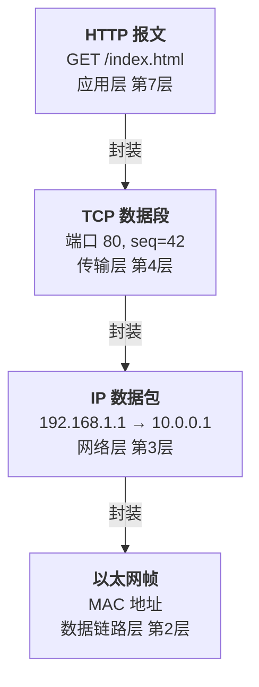
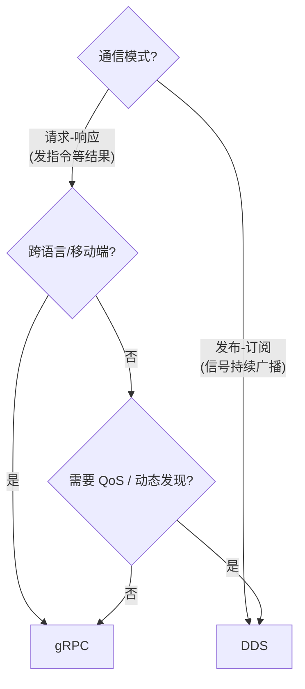

# 计算机科学

> 算法、数据结构、操作系统、计算机网络、计算机组成、编译原理、编程语言、软件工程

- [计算机网络](#计算机网络)
- [计算机组成](#计算机组成)

<details open>
<summary>

## 计算机网络

</summary>

<h3 style="color: #2563eb;">TCP 与 HTTP 的关系</h3>

<blockquote style="border-left: 4px solid #2563eb; padding: 12px 16px; background: #f0f4ff; margin: 12px 0; border-radius: 0 4px 4px 0;">
💡 <strong>一句话总结</strong>：TCP 是送货卡车负责可靠送达，HTTP 是装箱单描述货品内容——分层各管各的事。
</blockquote>

- **层级不同**：`HTTP` 是应用层协议（OSI 第 7 层），`TCP` 是传输层协议（OSI 第 4 层）。HTTP 建立在 TCP 之上
- **封装关系**：HTTP 报文被封装在 TCP 数据段中，TCP 段再被封装进 IP 包，逐层向下包装
- `TCP` 为 HTTP 提供**可靠传输**：保证数据不丢、不重、不乱序，还提供流量控制和拥塞控制
- **三次握手**：HTTP 请求发出前，TCP 已先完成三次握手，建立连接
- **不是绑定关系**：`HTTP/1.0` ~ `HTTP/2` 都依赖 TCP，但 `HTTP/3` 改用基于 `UDP` 的 `QUIC` 协议。HTTP 只需要底层提供可靠传输，TCP 只是历史上最合适的选择



---

<h3 style="color: #d97706;">纯 TCP 传数据的局限 —— 为什么需要 HTTP</h3>

<blockquote style="border-left: 4px solid #d97706; padding: 12px 16px; background: #fffbeb; margin: 12px 0; border-radius: 0 4px 4px 0;">
💡 <strong>一句话总结</strong>：TCP 只传无结构字节流，HTTP 定义了全世界通用的对话语义——自己用 TCP 造轮子不如用现成的标准。
</blockquote>

- `TCP` 只传输**无结构字节流**，对方收到后不知道字节的含义（是什么资源、成功还是失败、什么数据类型）
- **缺少请求语义**：没有 URL、Method（`GET`/`POST`）、状态码等概念，每个应用都要自己定义一套——路径格式、成功/失败编码、数据长度分隔方式
- **缺少元数据**：没有 Header 机制，无法传递 `Content-Type`、`Content-Length`、`Cache-Control`、`Authorization` 等信息
- **无法互通**：每个公司自定义协议格式，A 的客户端无法与 B 的服务端通信——HTTP 提供了全世界统一的"对话语言"
- **分层职责不同**：TCP 解决"怎么可靠送达"（传输层），HTTP 解决"对话的语义是什么"（应用层）
- `HTTP/3` 的佐证：抛弃 TCP 改用 QUIC（UDP），说明 HTTP 的本质是一套语义规范，不绑定具体传输层

---

<h3 style="color: #dc2626;">车载场景：纯 TCP 传结构体的隐患</h3>

<blockquote style="border-left: 4px solid #dc2626; padding: 12px 16px; background: #fef2f2; margin: 12px 0; border-radius: 0 4px 4px 0;">
⚠️ <strong>一句话总结</strong>：二进制结构体跨端直传看似高效，实则埋了内存对齐、字节序、版本演进三颗雷，`HTTP + JSON` 可读可扩展更省心。
</blockquote>

- **内存对齐陷阱**：`C/C++` 结构体中 `bool` 后编译器可能插入 3～7 字节填充；Android ARM 与座舱 SoC 的 `sizeof(bool)` 可能不同（1 vs 4）
- **字节序风险**：跨架构（ARM ↔ x86）直接传二进制结构体，多字节字段的字节序可能相反
- **版本演进灾难**：结构体增加字段后，新旧端混用导致字段错位——二进制格式没有版本号，接收端无法判断是新格式还是旧格式
- **调试困难**：抓包看到十六进制 dump，无法肉眼判断；`HTTP + JSON` 直接人类可读
- **替代方案**：座舱域起 HTTP Server，Android 发 `POST` 请求带 JSON body，状态码 + Header 解决所有问题
- **其他车载方案**：`gRPC`（HTTP/2 + Protobuf）、`MQTT`（发布-订阅）、`SOME/IP`（AUTOSAR 体系）

---

<h3 style="color: #7c3aed;">gRPC 详解与 DDS 对比</h3>

<blockquote style="border-left: 4px solid #7c3aed; padding: 12px 16px; background: #f5f3ff; margin: 12px 0; border-radius: 0 4px 4px 0;">
💡 <strong>一句话总结</strong>：`gRPC` 是"打电话找特定的人办事"（远程函数调用），`DDS` 是"广播里喊话谁需要谁听"（全局数据空间）——前者适合请求-响应对，后者适合持续信号流。
</blockquote>

#### gRPC 是什么

- **远程过程调用框架**：调用远程服务像调用本地函数，Google 开源
- **三大部件**：`Protobuf`（IDL + 二进制序列化，比 JSON 小 3-10 倍）+ `HTTP/2`（多路复用、头部压缩、双向流）+ 代码生成器（`.proto` → 10+ 种语言）
- **四种模式**：Unary（一问一答）、Server Streaming（一问多答）、Client Streaming（多问一答）、Bidirectional（双向流）
- `.proto` 契约：定义 `service` 和 `rpc`，两端自动生成代码，彻底解决结构体手动对齐

#### 核心差异

| 维度 | gRPC | DDS |
|------|------|-----|
| **范式** | Client → Server RPC | Publisher ⇢ Subscriber |
| **发现** | 外部（DNS / etcd） | 内置动态发现 |
| **QoS** | 无（TCP 尽力而为） | Deadline / Reliability / Durability |
| **传输** | HTTP/2 over TCP | DDSI-RTPS over UDP |
| **零拷贝** | 不支持 | 同 SoC 共享内存 |
| **耦合** | 紧（Server 挂 = 停服） | 松（节点上下线无影响） |

#### 选型规则



- 一句话：**找特定节点办事用 gRPC，让数据自己流动用 DDS**

</details>

<details open>
<summary>

## 计算机组成

</summary>

<h3 style="color: #2563eb;">大端序与小端序</h3>

<blockquote style="border-left: 4px solid #2563eb; padding: 12px 16px; background: #f0f4ff; margin: 12px 0; border-radius: 0 4px 4px 0;">
💡 <strong>一句话总结</strong>：大端是"人读的顺"（高位在前），小端是"机器算的顺"（低位在前）——跨设备通信指定字节序不是限制你，是保证所有人解析出的数值一致。即数据从左往右读，还是从右往左读。
</blockquote>

### 什么是指定字节序

多字节数据（如 `int` 占 4 字节）在内存中有两种存放顺序：

```
值 0x12345678 在内存中：
大端：12 34 56 78  （高位在前，人类阅读习惯）
小端：78 56 34 12  （低位在前，CPU 计算习惯）
```

- **大端**：高位字节存低地址，网络传输、文件格式常用
- **小端**：低位字节存低地址，x86、ARM 默认都是用这种

### 为什么 DDS 要指定字节序

- DDS 在不同芯片之间传数据，发端和收端字节序可能不同
- 不指定的话 `0x12345678` 可能被解析为 `0x78563412`，数值完全错乱
- DDS IDL 里 `@endianness(little_endian)` 的作用是**约定统一**——大端芯片先转再发，小端芯片直接发

### 常见端序应用

| 场景 | 端序 | 原因 |
|------|------|------|
| 网络传输（TCP/IP） | 大端 | RFC 历史规定，`htons()` 即"主机序→网络序" |
| x86 / AMD64 | 小端 | 架构设计，8086 起就是小端 |
| ARM | 小端（默认） | 可切换，但默认小端 |
| CAN 总线 | 大端 | 车载通信标准 |
| JPEG / PNG / GIF | 大端 | 文件格式规范 |
| WAV 音频 | 小端 | RIFF 容器规定 |

### 检测本机端序

```c
int x = 1;
if (*(char*)&x == 1)  // 低字节 0x01 在低地址
    printf("小端\n");
else
    printf("大端\n");
```

---

<h3 style="color: #2563eb;">CPU 架构（ISA）与操作系统</h3>

<blockquote style="border-left: 4px solid #2563eb; padding: 12px 16px; background: #f0f4ff; margin: 12px 0; border-radius: 0 4px 4px 0;">
💡 <strong>一句话总结</strong>：CPU 架构是方言（硬件只会说这种话），操作系统是管家（管人、管物、管秩序）——ARM 是最流行的低功耗方言，x86 是桌面的强势方言，它们上面都可以跑各种管家。
</blockquote>

### ARM 是什么

ARM 是一种 **RISC 指令集架构**，公司不生产芯片，只卖 IP 授权：

```
ARM 公司 → 设计 ISA/核心 IP → 授权给：
  ├── 高通（Snapdragon）
  ├── 苹果（M1/M2/M3/A 系列）
  ├── 华为（麒麟）
  └── NVIDIA、Amazon、联发科...
```

- **RISC**：指令精简，一条指令做一件事，功耗极低
- **低功耗**：手机、平板、IoT、车载芯片首选
- **big.LITTLE**：大核干重活 + 小核干轻活，进一步省电
- 你车上 `SA8650` 的 CPU 核心就是 ARM 架构

### 主流架构对比

| 架构 | 类型 | 特点 | 典型场景 |
|------|------|------|----------|
| `x86-64` | CISC | 指令复杂、单条功能强、功耗高 | PC、服务器（Intel/AMD） |
| `ARM` | RISC | 低功耗、IP 授权、生态广 | 手机、车载、IoT、苹果 Mac |
| `RISC-V` | RISC | 开源免费、无授权费 | 嵌入式、AI 加速器、中国力推 |
| `MIPS` | RISC | 曾与 ARM 竞争，已衰落 | 路由器（逐渐被替代） |
| `LoongArch` | RISC | 龙芯自研，中国自主可控 | 国内信创 |

### RISC vs CISC：设计哲学

```
CISC（x86）：一条指令干多件事       RISC（ARM）：一条指令只干一件事
硬件做更多工作，指令集复杂          编译器做更多工作，指令集精简
追求单指令能力强                   追求省电 + 高频
```

不是谁更高级，是取舍不同。

### 架构 vs 操作系统

```
┌──────────────────────────┐
│     应用软件（App）        │
├──────────────────────────┤
│  操作系统（Linux/Android/ │  ← 管理硬件，提供统一接口
│  Windows/QNX）            │
├──────────────────────────┤
│  CPU 架构（x86/ARM/RISC-V）│  ← 硬件执行指令
└──────────────────────────┘
```

| | CPU 架构 | 操作系统 |
|------|----------|----------|
| **是什么** | 硬件能理解的指令集 | 管理硬件资源的软件 |
| **决定什么** | 程序怎么编译成机器码 | 文件怎么存、进程怎么调度 |
| **可换吗** | 不可，硬件固定 | 可，刷个系统就行 |

- 同一操作系统可跑在不同架构上（Linux 有 x86 版和 ARM 版）
- 但**二进制不通用**——ARM 的机器码 x86 不认识，必须重新编译

### 主流操作系统

| 系统 | 类型 | 特点 | 典型场景 |
|------|------|------|----------|
| `Linux` | 宏内核 | 开源、稳定、生态庞大 | 服务器、云、嵌入式、车载 |
| `Windows` | 混合内核 | GUI 成熟、闭源、x86 主力 | PC、游戏、企业办公 |
| `macOS` | 混合内核（XNU） | 苹果生态、Unix 系 | Mac、iOS 开发 |
| `Android` | Linux 内核 + Java 框架 | 移动端霸主、ARM 主力 | 手机、车载 IVI |
| `QNX` | 微内核 | 硬实时、功能安全认证 | 座舱域控、ADAS、工业控制 |
| `FreeRTOS` | 实时内核（RTOS） | 极小体积、极低延迟 | MCU、传感器节点 |
| `AUTOSAR CP` | 静态配置 RTOS | 车规级、功能安全 ASIL-D | 动力、底盘、车身 MCU |
| `AUTOSAR AP` | 自适应平台（Linux 基） | 动态部署、SOA | 自动驾驶、V2X 域控 |

#### Linux vs QNX：车载双雄

```
Linux                              QNX
─────────────────────────────      ─────────────────────────────
宏内核：所有驱动跑在内核态           微内核：只有最小核心在内核态
  ↓                                     ↓
一个驱动挂了可能拖垮系统              一个驱动挂了，内核不受影响
  ↓                                     ↓
适合：娱乐、导航、后台计算            适合：仪表、制动、ADAS
开源免费                              商业授权（黑莓旗下）
生态大，招人好找，资料多              硬实时 + ASIL 功能安全认证
```

- **车上两套并用**：座舱娱乐用 Linux/Android（生态好），仪表和制动用 QNX（不能死机）
- **AUTOSAR**：汽车行业特有——CP 跑在 MCU 上管发动机，AP 跑在 SoC 上做自动驾驶

---

<h3 style="color: #2563eb;">交叉编译</h3>

<blockquote style="border-left: 4px solid #2563eb; padding: 12px 16px; background: #f0f4ff; margin: 12px 0; border-radius: 0 4px 4px 0;">
💡 <strong>一句话总结</strong>：交叉编译就是当翻译——在 x86 PC 上写代码，编译出 ARM 芯片能跑的二进制。你的 YfMiner 从 PyTorch 到 SA8650 上跑的 `.dlc`，全程都是交叉编译。
</blockquote>

### 是什么

```
本地编译：x86 上编 → x86 上跑（编译 = 运行同一架构）
交叉编译：x86 上编 → ARM 上跑（编译 ≠ 运行不同架构）
```

在 A 架构的电脑上，用专门的工具链，生成 B 架构的可执行文件。

### 什么时候用到

| 场景 | 为什么必须交叉编译 |
|------|-------------------|
| `YfMiner` 部署 SA8650 | SA8650 是 ARM，训练在 x86 服务器上 |
| Android App 开发 | 开发机 x86，APK 跑在 ARM 手机上 |
| 嵌入式/IoT | MCU 太弱跑不动编译器，PC 上好烧录 |
| 车载 ECU | 域控 ARM/QNX，开发在 x86 PC |
| 树莓派 | ARM 板编译大项目很慢，PC 上快几十倍 |

### 你的项目就是典型

```
开发机（x86_64）                   SA8650（aarch64/ARM）

PyTorch 模型训练                       .dlc 运行
    ↓                                      ↑
导出 ONNX                                 │
    ↓                                      │
QNN SDK --target aarch64 ──────────────────┘
```

`--target aarch64` 就是在告诉编译器：不要生成 x86 机器码，生成 ARM 的。

### 为什么目标设备不自己编译？

- 性能不够：嵌入式芯片编译大型项目慢到不可接受
- 没有完整工具链：MCU 上根本没有 GCC/Clang
- 原始（bare-metal）：没操作系统，跑不了编译器
- 标准化：CI/CD 统一在服务器编译，分发到各设备

### 工具链命名

```
arm-linux-gnueabihf-gcc      → 编 ARM Linux 程序
aarch64-linux-android-gcc    → 编 ARM64 Android 程序
riscv64-unknown-elf-gcc      → 编 RISC-V 裸机程序
```

命名规则：`<目标架构>-<目标系统>-<ABI>-<工具>`

</details>
